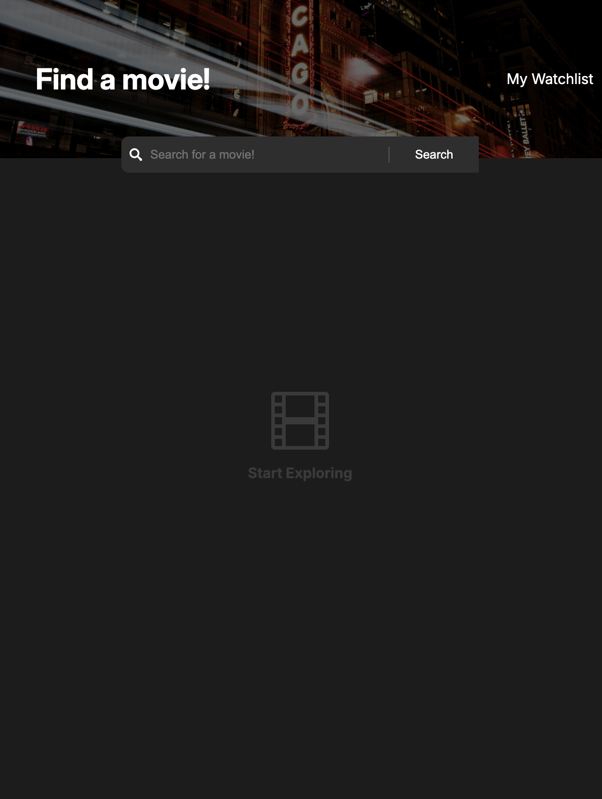
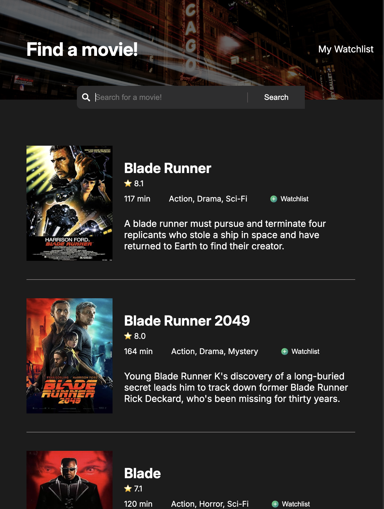
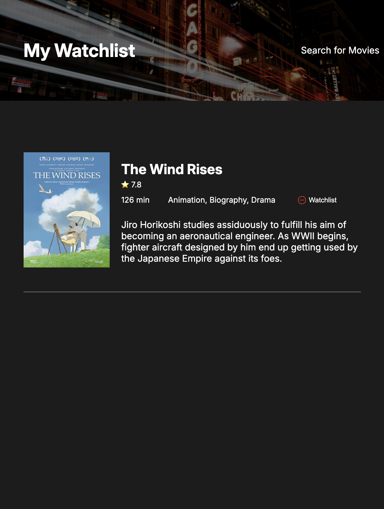

# Movie Watchlist

A two-page movie search and watchlist app that pulls live film data from the OMDB API and saves your picks in the browser, built with vanilla HTML, CSS, and JavaScript.

  
  
  

---

## Features

- Search any film title and get a list of matching movies from the OMDB API
- Each result shows its poster, IMDb rating, runtime, genre, and plot
- Full movie details are fetched for every result at once, so the list loads quickly
- Add movies to your watchlist with one click, with duplicates automatically prevented
- Watchlist is saved in the browser, so it's still there after a refresh or a return visit
- A separate watchlist page displays your saved movies, with a button to remove each one
- Friendly messages for a fresh start, a search with no results, and an empty watchlist
- Dark themed UI with a header search bar that overlaps the banner image

---

## Built With

- **HTML5**
- **CSS3** — Flexbox layout, absolute positioning, dark theme styling
- **JavaScript** — DOM manipulation, the Fetch API, and localStorage
- **[OMDB API](https://www.omdbapi.com/)** — external API for movie search results and details

---

## Skills Showcased

- Fetching data from an API with `async` / `await`
- Running multiple requests at once with `Promise.all()`
- Rendering content dynamically from API data
- Handling clicks on dynamically created buttons with event delegation
- Saving data between pages with `localStorage`